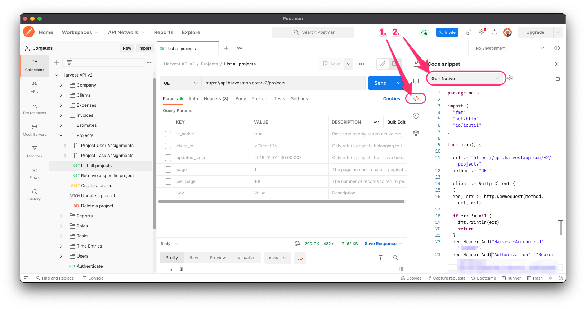

# harvest-go-cli

## Warning **Still in development!!**
Not ready to be used yet.

Do time reporting from your terminal.

## Interesting links
* becoded/go-harvest => [https://github.com/becoded/go-harvest](https://github.com/becoded/go-harvest)
* Json to Go structs(Really helpful!!) => [https://mholt.github.io/json-to-go/](https://mholt.github.io/json-to-go/)
* JSON Unmarshal issues:
* * [https://github.com/dgrijalva/jwt-go/issues/345](https://github.com/dgrijalva/jwt-go/issues/345)
* * * Check out the fiddle in the Go playgrond
* * * [With error](https://go.dev/play/p/WT5yd2X_iCI)
* * * [Without error](https://go.dev/play/p/2NOnAf267HA)
* * Stackoverflow: How to access key and value [from json array in go lang](https://stackoverflow.com/questions/52433236/how-to-access-key-and-value-from-json-array-in-go-lang).
* Harvest API:
* * Go Sample Repo => [github.com/harvesthq/harvest_api_samples](https://github.com/harvesthq/harvest_api_samples/blob/master/v2/harvest_api_sample.go)
* * Help -> [Documentation Overview](https://help.getharvest.com/api-v2/)
* * Help -> [Projects Documentation](https://help.getharvest.com/api-v2/projects-api/projects/projects/)
* * Help -> [Code Samples](https://help.getharvest.com/api-v2/introduction/overview/code-samples/)
* * Help -> [Postman Collection](https://help.getharvest.com/api-v2/introduction/overview/postman-collection/), Postman has a feature that will generate code in prefered language.

